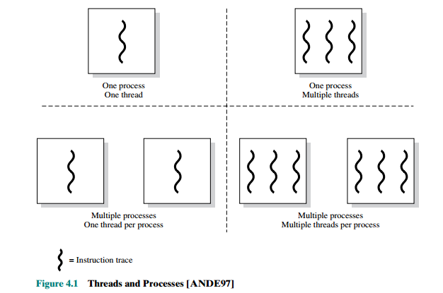

# Chapter 4 - Threads

## 4.1 Processes and Threads

- the concept of a process as embodies two characteristics:
    1. **Resource ownership** :
        - A process includes a virtual address space to hold the
process image. From
time to time, a process may be allocated control or ownership of resources,
such as main memory, I/O channels, I/O devices, and files. The OS performs a
protection function to prevent unwanted interference between processes with
respect to resources.
    2. **Scheduling/execution** :
        - The execution of a process follows an execution path
(trace) through one or more programs. This execution may
be interleaved with that of other processes.
        - a process has an execution
state (Running, Ready, etc.) and a dispatching priority and is the entity that is
scheduled and dispatched by the OS.

To distinguish the two characteristics, the **unit of dispatching is usually referred to as a thread or lightweight process**, while **the unit of resource ownership is usually referred to as a process or task.**

### Multithreading

> refers to the ability of an OS to support multiple, concurrent paths
of execution within a single process.

* for the figure

    - The two arrangements shown in the left half of
    the figure are single-threaded approaches.
    - The right half of figure depicts multithreaded approaches
    - single-threaded OS eg.  MS-DOS
    - Multi-threaded OS eg. Java run-time environment, windows, solaris
    - UNIX supports multiple user processes but only supports one thread per process


* **In a multithreaded environment, a process is defined as the unit of resource allocation and a unit of protection.**
    - The processes in an operating system must be protected from one another's activities. To provide such protection, we can use various mechanisms to ensure that only processes that have gained proper authorization from the operating system can operate on the files, memory segments, CPU, and other resources of a system.
    - OS supports protection and resource ownership on "Process-level" not thread-level thus the process is defined as the unit of resource
        allocation and a unit of protection.


 In a multithreaded environment, there is
still a single process control block and user address space associated with the process, but now there are separate stacks for each thread, as well as a separate control block for each thread containing register values, priority, and other thread-related
state information.


* The key benefits of threads derive from the performance implications

    1. It takes far less time to create a new thread in an existing process than to
        create a brand-new process (10x faster in UNIX).
    2. It takes less time to terminate a thread than a process.
    3. It takes less time to switch between two threads within the same process than
        to switch between processes.
    4. Threads enhance efficiency in communication between different executing
    programs because threads shares common address space


* examples of the uses of threads in a single-user multiprocessing system:

    1. Foreground and background work
        - A background thread is a thread that doesn't have complete focus at the moment. By focus, we mean processor time. In other words, it isn't processing as quickly, or it isn't processing at all.
        - eg. in a spreadsheet program,
one thread could display menus and read user input, while another thread
executes user commands and updates the spreadsheet.
    2. Asynchronous processing
        - asynchronus tasks can be implemented using threads.
        - An asynchronous model allows multiple things to happen at the same time. So one thread doesn't have to wait for another to finish.
        - eg. ```Thread(A)``` performs ```Task (1)``` and needs to perform some IO request (maybe to backup some data to the disk) this task can be delegated to another thread say ```Thread(B)``` while ```Thread(A)``` proceeds with ```Task(2)```
    3. Speed of execution
        -  due to the fact that multiple threads from the same process may be able to execute simultaneously
    4. Modular program structure
        - for Programs that involve a variety of activities or a variety of sources and destinations of input and output, threads act as modules that make up the program


* scheduling and dispatching is done on a thread
basis, so most of the state information dealing with execution is maintained in
thread-level data structures. **However**, process termination and suspension are done one "process-level" and because they affect the process memory space, they affect all threads of a process.

### Thread Functionality

- Thread states :
    - Ready : waiting for CPU time
    - Running : currently in execution
    - Blocked : waiting for an event (disk I/O, incoming network packet, etc.)
- Thread operations that affect its state:
    - Spawning :
        - every newly spawned process has a main thread spawned by default.
        -  The new thread is provided with its own register
context and stack space and placed on the ready queue.
    - Blocking
        - when a thread needs to wait for an event.
        - user registers, program counter, and stack pointers are saved
    - Unblocking
        - A thread unblocks when the event it is waiting on occurs
        - unblocking moves the thread to the ready queue
    - Finishing
        - When a thread completes, its register context and stacks are
deallocated.

> Blocking of one thread does not block the entire process

#### Example on multithreading in a uniprocessor environment


- On a uniprocessor, multiprogramming enables the interleaving of multiple
threads within multiple processes.
- in the figure, three threads in
two processes are interleaved on the processor. Execution passes from one thread
to another either when the currently running thread is blocked or when its time slice
is exhausted.

**Note :** in a uniprocessor environment, threads get blocked on I/O request and also on exhausting their time quanta. Multi-threading is achieved through interleaving threads.

**Thread Synchronization**
is the -ve side to threads sharing the same address space and process-owned resources where they can interfere with each other and corrupt the data.

## 4.2 Types of threads

#### user-level threads

- The kernel is not aware of user-level threads and manages them as if they where single-threaded processes.
- The kernel
continues to schedule the process as a unit and assigns a single execution state
(Ready, Running, Blocked, etc.) to that process.
- Thread
management is done by the application in particular a threads library, which is a package of
routines for ULT management.
-  The threads library contains code for
    - creating and destroying threads,
    - passing messages and data between threads
    - scheduling
thread execution
    - saving and restoring thread contexts.


##### Example

figure 4.6 describes possible scenarios to clarify the relationship between thread scheduling and process scheduling.

**Case 1 : Process blocked on IO**


- The application executing in thread 2 makes a system call that blocks B. For
example, an I/O call is made.
- This causes control to transfer to the kernel. The
kernel invokes the I/O action, places process B in the Blocked state, and switches
to another process.
- Meanwhile, according to the data structure maintained by the threads library, thread 2 of process B is still in the Running state.
    - It is important to note that thread 2 is not actually running in the sense of being executed
on a processor; but it is perceived as being in the Running state by the threads
library.

**Case 2 : Process blocked on timeout**


- A clock interrupt passes control to the kernel, and the kernel determines
that the currently running process (B) has exhausted its time slice.
- The
kernel places process B in the Ready state and switches to another process.
- Meanwhile, according to the data structure maintained by the threads library,
thread 2 of process B is still in the Running state. (seen as being in the Running state by the threads
library)

**Case 3 : Thread 2 blocks**


- Thread 2 has reached a point where it needs some action performed by thread
1 of process B.
- Thread 2 enters a Blocked state and thread 1 transitions from
Ready to Running.
- The process itself remains in the Running state.
##### Advantages to the use of ULTs instead of KLTs
- since all of the
thread management data structures are within the user address space of a single process, no need to switch to kernel mode for thread management
- Scheduling can be application specific; each application chooses the scheduling policy that fits it most. (no need to disturb the underlying OS scheduler)
- The threads library is a set of application-level functions
shared by all applications so they can run on any OS (OS independant)
##### Disadvantages of ULTs compared to KLTs
- In a typical OS, many system calls are blocking. As a result, when a ULT
executes a system call, not only is that thread blocked, but also all of the
threads within the process are blocked.
- In a pure ULT strategy, a multithreaded application cannot take advantage
of multiprocessing. A kernel assigns one process to only one processor at a
time. Therefore, only a single thread within a process can execute at a time.


##### Jacketing ( to overcome thread-blocking the whole process problems)

- The purpose of jacketing is to convert a blocking
system call into a nonblocking system call. For example, instead of directly calling
a system I/O routine, a thread calls an application-level I/O jacket routine. Within
this jacket routine is code that checks to determine if the I/O device is busy. If it is,
the thread enters the Blocked state and passes control (through the threads library)
to another thread. When this thread later is given control again, the jacket routine
checks the I/O device again.

#### Kernel-level threads
- In a pure KLT facility, all of the work of thread
management is done by the kernel. There is no thread management code in the
application level
- Windows OS adopts this design approach
##### Advantages
- This approach overcomes the
two principal drawbacks of the ULT approach
    1. the kernel can simultaneously
schedule multiple threads from the same process on multiple processors.
    2. if one thread in a process is blocked, the kernel can schedule another thread of
the same process
- kernel routines
themselves can be multithreaded.
##### Disadvantages
- The principal disadvantage of the KLT approach compared to the ULT
approach is that the transfer of control from one thread to another within the same
process requires a mode switch to the kernel.

#### Combined approaches
- thread creation, scheduling and synchronization of
threads is done
completely in user space.
- The multiple ULTs from a single application are
mapped onto some (smaller or equal) number of KLTs
- In a combined approach, multiple threads within the same application can
run in parallel on multiple processors, and a blocking system call need not block
the entire process
- Solaris OS adopts this design approach
