# Chapter 5
- fundamental to OS design, is concurrency.
Concurrency encompasses a host of design issues, including communication among processes, sharing of and competing for resources (such as memory, files, and I/O access),
synchronization of the activities of multiple processes, and allocation of processor time
to processes.

- The central themes of operating system design are all concerned with the management of processes and threads:
    - Multi-programming: The management of multiple processes within a uniprocessor system
    - Multi-processing: The management of multiple processes within a multiprocessor
    - Distributed processing: The management of multiple processes executing on
multiple, distributed computer systems.

- Concurrency arises in three different contexts:
    - Multiple applications: Multiprogramming was invented to allow processing
    time to be dynamically shared among a number of active applications.
    - Structured applications: As an extension of the principles of modular design
    and structured programming, some applications can be effectively programmed
    as a set of concurrent processes.
    - Operating system structure: The same structuring advantages apply to systems
programs, and we have seen that operating systems are themselves often implemented as a set of processes or threads.

## Software approaches

**Author Note**
 : the asterisk symbol (*)  used in code snippets under the "Why it fails" section means that the process is not curently executing because the other process has the processor.


### First attempt
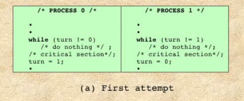
#### Why it fails
1. Alternating turns *enforces* that both processes are interested
in entering the critical alternating turns each time which is a false assumption
	- this prevents any of them to execute the program consecutive times
2. If P0 enters the critical section and crashed(got killed for any reason) before setting `(turn = 1)` P1 can never execute causing halt.

### Second attempt
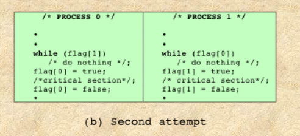

#### Why it fails
consider the following sequence of instructions
```
P0				                  p1
--				                  --
while(flag[1]) -> False            *    
"Control switched to p1"	       *
*				                while(flag[0]) -> False
*				                flag[1] = true
*				                Enter critical section
*				                "control switched to p0"
flag[0] = true                      *
Enter critical section              *
```
>**So, Both enter their critical sections disputing mutual exclusion**


### Third attempt
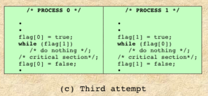

#### Why it fails
* consider the following sequence of instructions

```
p0				          p1
--				          --
flag[0] = True              *
"control switched to p1"	*
*				            flag[1] = True
*				            while(flag[0]) -> True
				            "control switched to p0"
while(flag[1]) -> True      *
/*do nothing
and keep busy waiting*/
"control switched to p1"    *
*				           /*do nothing
                            and keep busy waiting*/
```


>**Neither will ever execute ; they will keep busy waiting for each other thus, causing deadlock**


### Fourth attempt
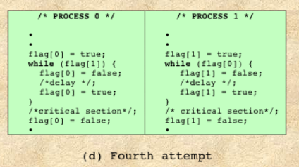
#### Why it fails

* consider this sequence of instructions where interleaving statements one by one alternating between processes

```
p0				          p1
--				          --
flag[0] = True             *
*           		        flag[1] = true
while(flag[1]) -> True      *
*				        while(flag[0]) -> True
flag[0] = false             *
*				        flag[1] = false
flag[0] =  true             *
*				        flag[1] = true
while(flag[1]) -> True      *
*				        while(flag[0]) -> True
```
>**And this sequence repeats indefinitely causing potential Livelock : processes keep alternating their states in a way that prevents both from entering the critical section**

### Dekker's
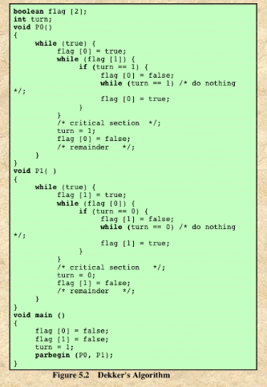

* [Click here for Reading](https://www.google.com/url?sa=t&rct=j&q=&esrc=s&source=web&cd=&cad=rja&uact=8&ved=2ahUKEwj89cnv15z0AhXWRvEDHcrZA8UQFnoECAQQAQ&url=https%3A%2F%2Fwww.geeksforgeeks.org%2Fdekkers-algorithm-in-process-synchronization%2F&usg=AOvVaw1DqIYgr_0lP_2dU5Uct8pb)

### Peterson's
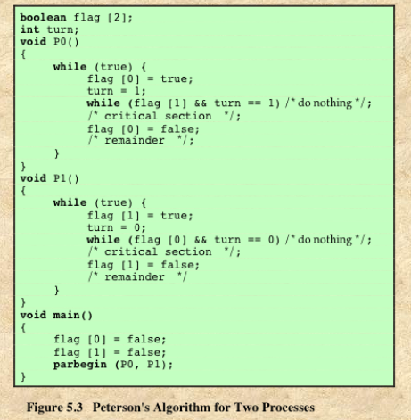

* [Click here for Reading](https://www.geeksforgeeks.org/n-process-peterson-algorithm/)

### Bakery's (Appeared on the sheet)
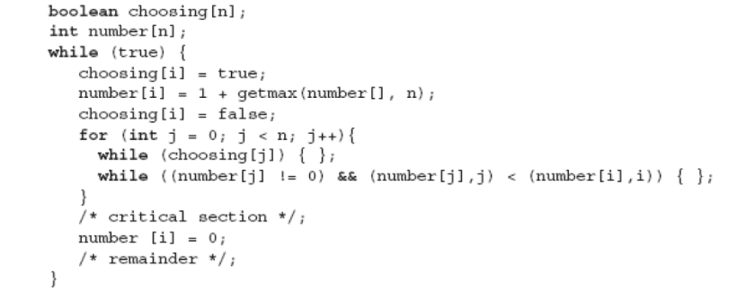

* [Click here for Reading](https://person.dibris.unige.it/delzanno-giorgio/SO1/AA0607/bakery.htm)

## 5.1 Principles of concurrency
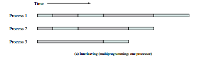

**Interleaving**
- In a single-processor multiprogramming system, processes are interleaved in time
to yield the appearance of simultaneous execution.
- Even though
actual parallel processing is not achieved, and even though there is a certain amount
of overhead involved in switching back and forth between processes, interleaved
execution provides major benefits in processing efficiency and in program structuring.
- the problems stem from a basic
characteristic of multiprogramming systems:
    - The relative speed of execution of
processes cannot be predicted.
    - It depends on the activities of other processes, the
way in which the OS handles interrupts, and the scheduling policies of the OS.

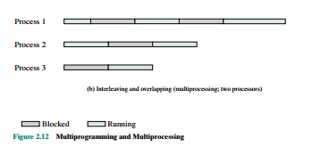

**Overlapping**
- In a multiple-processor system, it is possible not only to interleave the execution of
multiple processes but also to overlap them ( Figure 2.12b ).
At first glance, it may seem that interleaving and overlapping represent fundamentally different modes of execution and present different problems.

*both
techniques can be viewed as examples of concurrent processing, and both present
the same problems.*

### Difficulties of Concurrency
1. The sharing of global resources
    - For example, if two processes
both make use of the same global variable and both perform reads and writes on
that variable, then the order in which the various reads and writes are executed
is critical.
2. It is difficult for the OS to manage the allocation of resources optimally.
    - For example, `process A` may request use of, and be granted control of, a particular
I/O channel and then be suspended before using that channel. It may be undesirable for the OS simply to lock the channel and prevent its use by other processes; indeed this may lead to a deadlock condition.
3. It becomes very difficult to locate a programming error
    - because results are
typically not deterministic and reproducible.

### Race Condition

> A race condition occurs when multiple processes or threads read and write data
items so that the final result depends on the order of execution of instructions in the
multiple processes.

- The last executing process (Loser of the race) determines the final value of the variable.

### Operating System Concerns (issues raised due to concurrency)

The OS must :
1. be able to keep track of the various processes. (using PCB)
2. allocate and deallocate various resources for each active process.
At times, multiple processes want access to the same resource.
    - These resources
include : Processor time, memory, files, I/O
3. protect the data and physical resources of each process against
unintended interference by other processes. T
4. The functioning of a process, and the output it produces, must be independent
of the speed at which its execution is carried out relative to the speed of other
concurrent processes.

### Process Interaction

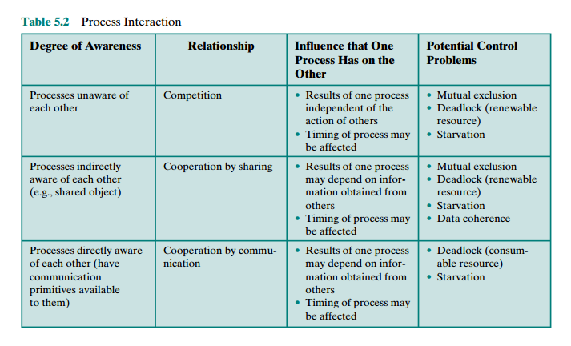

#### Competing for resources
- **Why it happens** Two or more
processes need to access a resource during the course of their execution. Each
process is unaware of the existence of other processes, and each is to be unaffected
by the execution of the other processes. It follows from this that each process should
leave the state of any resource that it uses unaffected.
- There is *no exchange of information* between the competing processes.
However, the execution of one process may affect the behavior of competing
processes.
- In particular, if two processes both wish access to a single resource, then
one process will be allocated that resource by the OS, and the other will have to wait.
Therefore, the process that is denied access will be slowed down. In an extreme case,
the blocked process may never get access to the resource and hence will never terminate successfully.

**Three control problems arrise**

1. **The need for mutual exclusion** : It is important that only one program at a time be
allowed in its critical section.
2. **Deadlock** : Each process is waiting for one of the two resources.
Neither will release the resource that it already owns until it has acquired the other
resource and performed the function requiring both resources. The two processes are
deadlocked.
3. **Starvation** : a process may indefinitely be denied access to the resource, even though there is no deadlock
situation.

*Note : deadlock and Starvation are side effects of enforcing mutual exclusion*

#### Cooperation by sharing
> processes that interact with other processes without being explicitly aware
of them. For example, multiple processes may have access to shared variables or
to shared files or databases. Processes may use and update the shared data without
reference to other processes but know that other processes may have access to the
same data.

- Because data are held on resources (devices, memory), the control problems
of mutual exclusion, deadlock, and starvation are again present.
- The only difference
is that data items may be accessed in two different modes, reading and writing, and
only writing operations must be mutually exclusive.
- **new problem arrised** data integrity (data coherence) : If the state is initially consistent, process interaction must leave the
shared data in a consistent state.

#### Cooperation by communication
> When processes cooperate by
communication, the various processes participate in a common effort that
links all of the processes. The communication provides a way to synchronize, or
coordinate, the various activities.

**control problems arrise**
- Because nothing is shared between processes in the act of passing messages,
mutual exclusion is not a control requirement for this sort of cooperation
- the problems of deadlock and starvation are still present.
    - **deadlock** : two processes may be blocked, each waiting for a communication from the
    other.
    - **starvation** : some processes exchange information repeatedly, while another
is blocked waiting for a communication from one of them.

### Requirements for Mutual Exclusion

1. Mutual exclusion must be enforced: Only one process at a time is allowed into
its critical section, among all processes that have critical sections for the same
resource or shared object.
2. A process that halts in its noncritical section must do so without interfering
with other processes.
3. It must not be possible for a process requiring access to a critical section to be
delayed indefinitely: no deadlock or starvation.
4. When no process is in a critical section, any process that requests entry to its
critical section must be permitted to enter without delay.
5. No assumptions are made about relative process speeds or number of processors.
6. A process remains inside its critical section for a finite time only.

## 5.2 Mutual exclusion : Hardware support
### Interrupt Disabling
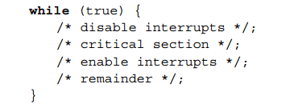

- In a uniprocessor system, concurrent processes cannot have overlapped execution;
they can only be interleaved
-  to guarantee mutual
exclusion, it is sufficient to prevent a process from being interrupted
- **Cons**
    1. The efficiency of execution
could be noticeably degraded because the processor is limited in its ability to
interleave processes.
    2. this approach will not work in a
multiprocessor architecture. So in this case, dis abled interrupts do not guarantee mutual exclusion.

### Special Machine Instructions
> Designers proposed several machine instructions that carry out two
actions atomically, such as reading and writing or reading and testing, of a single
memory location with one instruction fetch cycle. So, during execution of the instruction, access to the memory location is blocked for any other instruction referencing
that location.

#### Example : compare-and-swap instruction

- The only process that may enter
its critical section is one that finds bolt equal to 0
- Others are busy or spin waiting
- When a process
leaves its critical section, it resets bolt to 0; at this point one and only one of the waiting processes is granted access to its critical section. The choice of process depends
on which process happens to execute the compare&swap instruction next.
#### Example : exchange instruction

- The instruction exchanges the contents of a register with that of a memory location.

#### Advantages of machine-instruction support
- applicable to any number of processes on either a single processor or multiple processors sharing main memory.
- It is simple and therefore easy to verify.
- It can be used to support multiple critical sections; each critical section can be
defined by its own variable.

#### Disadvantages
- Busy waiting is employed
    - while a process is waiting for access to a critical section, it continues to consume processor time.
- starvation is possible
    - When a process leaves a critical section and more than
one process is waiting, the selection of a waiting process is arbitrary. Thus,
some process could indefinitely be denied access.
- Deadlock is possible (due to priority scheduling)
    - Consider the following scenario on a single-processor
system. Process P1 executes the special instruction (e.g., compare&swap,
exchange) and enters its critical section. P1 is then interrupted to give the
processor to P2, which has higher priority. If P2 now attempts to use the same
resource as P1, it will be denied access because of the mutual exclusion mechanism. Thus, it will go into a busy waiting loop. However, P1 will never be dispatched because it is of lower priority than another ready process, P2
