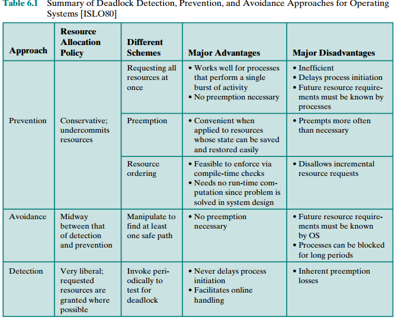

## Principles of Deadlock

> Deadlock is the permanent blocking of a set of processes that either
compete for system resources or communicate with each other.

- A set of processes
is deadlocked when each process in the set is blocked awaiting an event (typically
the freeing up of some requested resource) that can only be triggered by another
blocked process in the set.

### Reusable Resources
> A reusable resource is one that can be safely used by only one process at a time and
is not depleted by that use.
Processes obtain resource units that they later release
for reuse by other processes.

- Examples :
    - processors
    - I/O channels
    - main and secondary memory
    - devices
    - data structures such as
files, databases, and semaphores.

### Consumable Resources
> A consumable resource is one that can be created (produced) and destroyed (consumed). Typically, there is no limit on the number of consumable resources of a
particular type.

- Examples :
    - interrupts
    - signals
    - messages
    - information in I/O buffers

### Resource Allocation Graphs
- The resource allocation
graph is a directed graph that depicts a state of the system of resources and processes.
- A graph edge
directed from a process to a resource indicates a resource that has been requested
by the process but not yet granted.
- A graph edge directed from a reusable resource node dot to a
process indicates a request that has been granted.

- a dot means an instance of the resource.

- figure(d) has no deadlock due to availability of multiple instances of the resources.

### The Conditions for Deadlock
Three conditions of policy must be present for a deadlock to be **possible (i.e.no deadlock can occur without them)**.

BUT The first three conditions are **necessary but not sufficient for a deadlock** to
exist.
1. **Mutual exclusion**. Only one process may use a resource at a time. No process
may access a resource unit that has been allocated to another process.
2. **Hold and wait**. A process may hold allocated resources while awaiting assignment of other resources.
3. **No preemption**. No resource can be forcibly removed from a process holding it

4. **Circular wait**. A closed chain of processes exists, such that each process holds
at least one resource needed by the next process in the chain
> The unresolvable circular wait is in fact
the definition of deadlock

### Dealing with deadlock
#### prevent deadlock
>adopting a policy that eliminates one of the conditions
(conditions 1 through 4)

- deadlock prevention
methods as falling into two classes :
    - Indirect -> remove first 3 conditions
    - Direct -> remove condition 4

**Indirect approaches**
- **Mutual Exclusion** can't be eliminated
- **Hold and Wait** prevented by requiring that a process request
all of its required resources at one time and blocking the process until all requests
can be granted simultaneously
    - **Inefficient because** :
        - process may be held up for a long time waiting for all of its resource requests to be
filled, when in fact it could have proceeded with only some of the resources.
        - resources allocated to a process may remain unused for a considerable period,
during which time they are denied to other processes.
        - a process may not know in advance all of the resources that it will require.
- **No Preemption**
    - This approach is practical only when applied to resources whose state can be
easily saved and restored later, as is the case with a processor.
    - if a process holding certain
resources is denied a further request, that process must release its original resources
and, if necessary, request them again together with the additional resource.
    - if a process requests a resource that is currently held by another process, the OS may preempt the second process and require it to release its resources. *[Works only when the 2 processes have different priorities]*

**Direct approach**
- **Circular Wait** : prevented by defining a linear ordering of
resource types.
    - **Inefficient**
        - may be inefficient,
slowing down processes and denying resource access unnecessarily.

#### avoid deadlock
> Allows the three necessary conditions but
makes judicious choices based on the current state of resource allocation to assure that the deadlock point is never reached.

**Note** : Avoidance allows more concurrency than prevention.

**Approach 1 : Process Initiation Denial**
- Do not start a process if its demands might lead to deadlock.
- That is, a process is only started if the maximum claim of all current processes plus
those of the new process can be met.
- This strategy is hardly optimal, because it
assumes the worst: that all processes will make their maximum claims together.

**Approach 2 : Resource Allocation Denial [Banker's algorithm]**
- Do not grant an incremental resource request to a process if this allocation
might lead to deadlock.
- **A safe state** is one in which there is at least
one sequence of resource allocations to processes that does not result in a deadlock
(i.e., all of the processes can be run to completion).

##### Advantages of avoidance
- it is not necessary to preempt and
rollback processes, as in deadlock detection, and is less restrictive than deadlock
prevention.

##### Restrictions on using avoidance
- The maximum resource requirement for each process must be stated in
advance.
- The processes under consideration must be independent; that is, the order
in which they execute must be unconstrained by any synchronization
requirements.
- There must be a fixed number of resources to allocate.
- No process may exit while holding resources

#### Detect the presence of deadlock
>detect that conditions 1 through 4 hold and
take action to recover

- deadlock detection strategies do not limit resource
access or restrict process actions. With deadlock detection, requested resources are
granted to processes whenever possible.
- Periodically, the OS performs an algorithm
that allows it to detect the circular wait condition
- **frequency of the check** : per resource request, or less frequently.
- Checking
at each resource request has two advantages:
    - It leads to early detection.
    - the
algorithm is relatively simple because it is based on incremental changes to the
state of the system.
- Cons : such frequent checks consume considerable processor time.
##### Recovery
- listed in order of increasing sophistication:
    1. **Abort all deadlocked processes**. This is, believe it or not, one of the most
    common, if not the most common, solution adopted in operating systems.
    2. **Back up each deadlocked process to some previously defined checkpoint, and
    restart all processes**. This requires that rollback and restart mechanisms be built
    in to the system. The risk in this approach is that the original deadlock may
    recur. However, the nondeterminancy of concurrent processing may ensure that
    this does not happen.
    3. **Successively abort** deadlocked processes until deadlock no longer exists. The
    order in which processes are selected for abortion should be on the basis of
    some criterion of minimum cost. After each abortion, the detection algorithm
    must be reinvoked to see whether deadlock still exists.
    4. **Successively preempt resources** until deadlock no longer exists. As in (3), a cost-based selection should be used, and reinvocation of the detection algorithm is
    required after each preemption. A process that has a resource preempted from
    it must be rolled back to a point prior to its acquisition of that resource.

#### Deadlock approaches studied

## Integrated deadlock strategy
- Group resources into a number of different resource classes.
- Use the linear ordering strategy defined previously for the prevention of circular
wait to prevent deadlocks between resource classes.
- Within a resource class, use the algorithm that is most appropriate for that class

Within each class, the following strategies
could be used:

- **Swappable space**: Prevention of deadlocks by requiring that all of the required
resources that may be used be allocated at one time, as in the hold-and-wait
prevention strategy. This strategy is reasonable if the maximum storage
requirements are known, which is often the case. Deadlock avoidance is also a
possibility.
- **Process resources**: Avoidance will often be effective in this category, because
it is reasonable to expect processes to declare ahead of time the resources that
they will require in this class. Prevention by means of resource ordering within
this class is also possible.
- **Main memory**: Prevention by preemption appears to be the most appropriate
strategy for main memory. When a process is preempted, it is simply swapped
to secondary memory, freeing space to resolve the deadlock.
- **Internal resources**: Prevention by means of resource ordering can be used

## Dining Philosophers problem
https://cs.stanford.edu/people/eroberts/courses/soco/projects/1998-99/randomized-algorithms/examples/distributed.html
