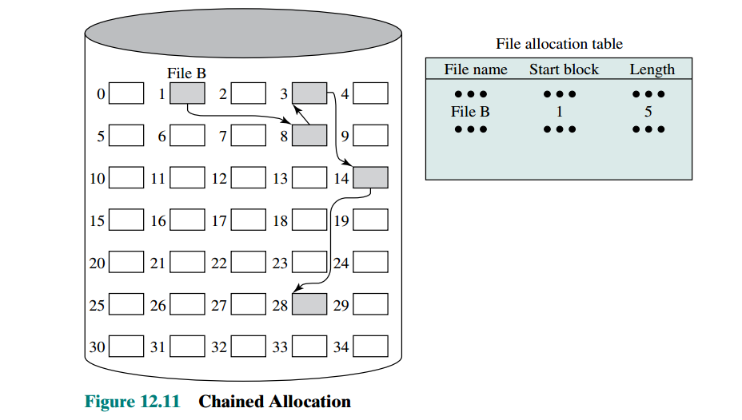
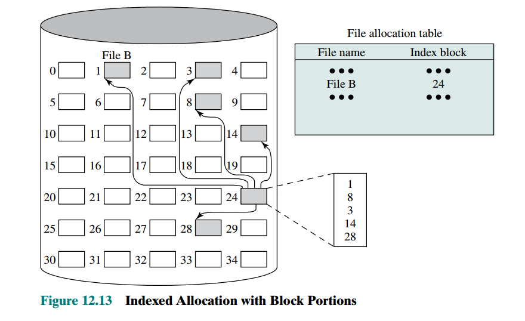
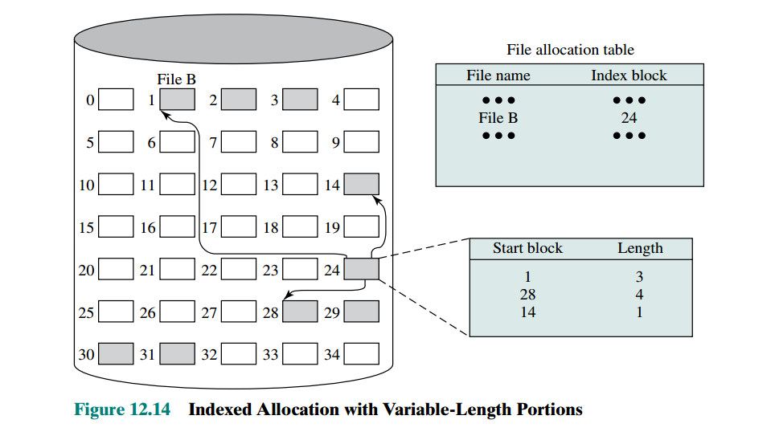

## Files and File Systems
- **desirable properties for files are**:
    - **Long-term existence**: stored on disk or other secondary storage and
    do not disappear when a user logs off.
    - **Shareable between processes**: can have associated access
    permissions that permit controlled sharing.
    - **Structure**: has an internal structure
    that is convenient for particular applications.
- **desirable features for file management systems**:
    - To meet the data management needs and requirements of the user, which include
storage of data and the ability to perform the aforementioned operations
    - To guarantee, to the extent possible, that the data in the file are valid
    - To optimize performance, both from the system point of view in terms of
    overall throughput and from the user’s point of view in terms of response time
    - To provide I/O support for a variety of storage device types
    - To minimize or eliminate the potential for lost or destroyed data
    - To provide a standardized set of I/O interface routines to user processes
    - To provide I/O support for multiple users, in the case of multiple-user systems
- **minimal set of user requirements for files**:
    1. Each user should be able to create, delete, read, write, and modify files.
    2. Each user may have controlled access to other users’ files.
    3. Each user may control what types of accesses are allowed to the user’s files.
    4. Each user should be able to restructure the user’s files in a form appropriate to
    the problem.
    5. Each user should be able to move data between files.
    6. Each user should be able to back up and recover the user’s files in case of
    damage.
    7. Each user should be able to access his or her files by name rather than by
numeric identifier.
## File Structure
- **Field** :
    - is the basic element of data and it contains a single value
    - can have fixed length or variable length (design option)
- **Record** :
    - collection of related fields that can be treated as a unit by some
application program.
    - may be of fixed length or variable length
- **File** :
    -  a collection of similar records
    - treated as a single entity
    -
- **Database** :
    - a collection of related data.
    - Database relationships that exist among elements of data must be explicit and that the
database is designed for use by a number of different applications.

## file system architecture

#### device drivers
- communicate directly with peripheral devices or their controllers or channels.
- responsible for starting I/O requests on a device and processing
its completion.
- Device drivers are usually considered to be part of the
operating system.

####  physical I/O level (Basic File System)
- the primary interface with the environment outside of the computer system.
- concerned with the placement of blocks of data that are exchanged with disk or tape systems on the secondary storage device and
on the buffering of those blocks in main memory.
-  It does not understand the content of the data or the structure of the files involved.
- considered part of the operating system.
#### Basic I/O supervisor
- responsible for all file I/O initiation and termination.
- I/O buffers are assigned and secondary memory is allocated at this level
- At this level, control structures are maintained that deal with device I/O,
scheduling, and file status.
- selects the device on which file
I/O is to be performed, based on the particular file selected.
- concerned
with scheduling disk and tape accesses to optimize performance.
#### Logical I/O
- enables users and applications to access records.
- provides a general-purpose record I/O capability and maintains basic data about files.

**the basic file system deals with blocks of data while the logical I/O module deals with file
records**

#### Access Method
- It provides a standard interface between applications and the file systems
and devices that hold the data.
- Different access methods reflect different file structures and different ways of accessing and processing the data.

## File directories
- contains information about the files, including attributes, location,
and ownership.
- The directory is itself a file, accessible by various file management routines.

### Structure
#### sequential list
- a list of entries, one for
each file represented by a simple sequential file, with the
name of the file serving as the key.
- **Cons**
    - it provides no help in organizing the files
    - forces the user
to be careful not to use the same name for two different types of files. The problem is much worse in a shared system. Unique naming becomes a serious problem.
    - it is difficult to conceal portions of the overall directory from users
when there is no inherent structure in the directory.
#### 2-level scheme
- there is one directory for each user, and a master directory.
    - The `master
directory` has an entry for each user directory, providing address and access control information.      
    - `user directory` is a simple list of the files of that user.
- **Pros**
    - This
arrangement means that names must be unique only within the collection of files
of a single user and that the file system can easily enforce access restriction on
directories.
- **Cons**
    - it still provides users with no help in structuring collections
of files.
#### hierarchical tree-structure
- same structure as 2-level scheme except that
- these user directories, in turn, may have subdirectories and files as entries.
- **subdirectory organization**
    - The simplest
approach, of course, is to store each directory as `a sequential file`.
    - When directories
may contain a very large number of entries, such an organization may lead to unnecessarily long search times `a hashed structure` is to be preferred.

## File sharing
#### Issue 1 | Access Rights
**Rights**
> These rights can be considered to constitute a hierarchy, with each right implying those that precede it.
None - knowledge - Execution - Reading - Appending - Updating - changing protection - deletion

- None:
    - not even learn of the existence of the file by not being allowed to read the
user directory that includes this file.
- Knowledge:
    - can determine that the file exists and who its owner is and petition the owner for additional access rights.
- Execution:
    - The user can load and execute a program but cannot copy it.
Proprietary programs are often made accessible with this restriction.
- Reading:
    - The user can read the file for any purpose, including **copying** and
execution.
- Appending:
    - can add data to the file, often only at the end NOT
modify or delete any of the file’s contents.
- Updating:
    - can modify, delete, and add to the file’s data. (writing the file initially, rewriting it completely or in part, and removing all or a portion of the data)
- Changing protection:
    - can change the access rights granted to other
users.
    - Typically, this right is held only by the owner of the file and can extend this right to others.
- Deletion: The user can delete the file from the file system.
**Users**
1. owner of a given file : the person who initially
created a file.
2. Specific user: Individual users who are designated by user ID
3.  User groups: A set of users who are not individually defined. The system must
have some way of keeping track of the membership of user groups.
4. All: All users who have access to this system. *These are public files*.

#### Issue 2 | Simultaneous Access
- shared access should be exclusive by either :
    - A brute-force
approach is to allow a user to **lock the entire file** when it is to be updated.
    - A finer
grain of control is to **lock individual records during update**.
---
## File Allocation
#### Pre-allocation vs dynamic allocation
- A pre-allocation policy requires
that the maximum size of a file be declared at the time of the file creation request.
- for many applications, it
is difficult if not impossible to estimate reliably the maximum potential size of the
file
- This clearly is wasteful from the point of view
of secondary storage allocation because users often over-estimate space.
- Dynamic allocation : allocates space to a file in portions as needed.

#### Portion Size per file

There are two alternatives :
- **Variable, large contiguous portions**: This will provide better performance. The
    - **pros** variable size avoids waste, and the file allocation tables are small
    - **cons** space is hard to reuse.
- **Blocks**:
    - **pros** Small fixed portions provide greater flexibility (contiguity abandoned)
    - **cons** They may require
large tables or complex structures for their allocation.

When deciding the portion size consider the following facts :
1. **Contiguity of space** increases performance, especially for `Retrieve_Next`
operations, and greatly for transactions running in a transaction-oriented
operating system.
2. Having **a large number of small portions** increases the size of tables needed to
manage the allocation information.
3. Having **fixed-size portions (e.g., blocks)** simplifies the reallocation of space.
4. Having **variable-size or small fixed-size portions** minimizes waste of unused
storage due to over-allocation.

### File Allocation Techniques
#### 1 | Contiguous Allocation (pre-allocation using variable-size portions)

- a single contiguous set of blocks is allocated to a
file at the time of file creation
- The file allocation table needs just a single entry for
each file, showing the starting block and the length of the file
- **Problems**
    - External fragmentation will occur,
making it difficult to find contiguous blocks of space of sufficient length.
    - it will be necessary to perform a compaction algorithm to free up additional
space on the disk.

#### 2 | Chained Allocation (allocate blocks as needed)

- allocation is on an individual block basis. Each block contains a pointer to the next block in the chain. Again, the file allocation table needs
just a single entry for each file
- **pros**
    - The selection of blocks is now a simple matter: Any free block can be
added to a chain.
    - There is no external fragmentation to worry about because only one block at a time is needed.
- **cons**
    - suits sequential files but not direct access file because selecting an individual block
of a file requires tracing through the chain to the desired block. (direct access is not efficient in linked lists)
    -  no accommodation of the principle of locality (**Consolidate** files frequently to accommodate this)

#### 3 | Indexed allocation (fixed or variable-size proportions)

- Allocation by blocks
eliminates external fragmentation, whereas allocation by variable-size portions
improves locality.
- the file indexes are not physically stored as part of the file allocation table. Rather, the
file index for a file is kept in a separate block, and the entry for the file in the file allocation table points to that block.
- file consolidation may be done from time to time.
File consolidation reduces the size of the index in the case of variable-size portions,
but **NOT** in the case of block allocation.
- supports **both** sequential
and direct access to the file

## Free Space Management
#### 1 | Bit Tables
- This method uses a vector containing one bit for each block on the
disk. Each entry of a 0 corresponds to a free block, and each 1 corresponds to a
block in use.
- **Pros**
    - relatively easy to find one or a contiguous group of free blocks.
    - as small as possible.

#### 2 | Chained Free Portions
- The free portions may be chained together by using
a pointer and length value in each free portion.
- **Pros** no need for a disk allocation table
- **Cons**
    - the disk will become quite
fragmented and many portions will be a single block long.
    - every
time you allocate a block, you need to read the block first to recover the pointer to
the new first free block before writing data to that block

#### 3 | Indexing
- treat free space as a file and uses an index table
as described under file allocation (index should be on the basis
of variable-size portions rather than blocks)

## Volumes
> A collection of addressable sectors in secondary memory that an OS or
application can use for data storage. The sectors in a volume *need not be consecutive on a physical storage device*; instead, they need only appear that way to
the OS or application. A volume may be the result of assembling and merging
smaller volumes.

- In the simplest case, **a single disk equals one volume**.
- Frequently, a disk is
divided into partitions, with **each partition functioning as a separate volume**.
-  It is
also common to treat **multiple disks as a single volume or partitions on multiple
disks as a single volume**.
